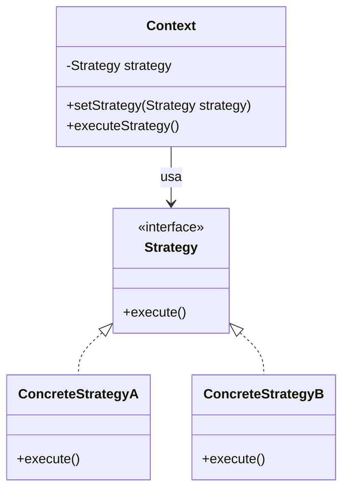

# State

## Propósito
Permite que un objeto modifique su comportamiento cada vez que cambie su estado interno. Parecerá que cambia la clase del objeto. 

## Aplicabilidad
- El comportamiento de un objeto depende de su estado, y debe cambiar en tiempo de ejecución dependiendo de ese estado.
- Las operaciones tienen largas sentencias condicionales con múltiples rames que dependen del estado del objeto. Este estado se suele representar por una o más constantes enumeradas. 
	- Muchas veces son varias las operaciones que contienen esta misma estructura condicional. 
	- El patrón State pone cada rama de la condición en una clase aparte. Esto nos permite tratar al estado del objeto como un objeto de pleno derecho que puede variar independientemente de otros objetos.

## Estructura
![[Pasted image 20250205194203.png]]

## Participantes
- **Contexto**
	- Define la interfaz de interés para los clientes.
	- Mantiene una instancia de una subclase de *EstadoConcreto* que define el estado actual.
- **Estado Abstracto**
	- Define una interfaz para encapsular el comportamiento asociado con un determinado estado del *Contexto*
- **Subclases de Estado Concreto**
	- Cada subclase implementa un comportamiento asociado con un estado del *Contexto*.

## Colaboraciones
- *Contexto* delega las peticiones que dependen del estado en el objeto *Estado Concreto* actual.
- Un *Contexto* puede pasarse a si mismo como parámetro para que el objeto *Estado Abstracto* maneje la petición. Esto permite al objeto *Estado Abstracto* acceder al contexto si fuera necesario.
- *Contexto* es la interfaz principal para los clientes. Los clientes pueden configurar un contexto con objetos *Estado Abstracto*. Una vez que está configurado el contexto, sus clientes ya no tienen que tratar con los objetos *Estado Abstracto* directamente.
- Cualquiera de las subclases de *Contexto* o de *Estado Concreto* pueden decir qué estado sigue a otro y bajo qué circunstancias.

# Strategy

## Propósito
Define una familia de algoritmos, encapsula cada uno de ellos y los hace intercambiables. Permite que un algortmo varíe independientemente de los clientes que lo usan. 

## Aplicabilidad
- Muchas clases relacionadas difieren sólo en su comportamiento. Las estrategias permiten configurar una clase con un determinado comportamiento de entre muchos posibles.
- Se necesitan distintas variantes de un algoritmo, por ejemplo, podríamos definir algoritmos que reflejasen distintas soluciones de compromiso entre tiempo y espacio. Pueden usarse estrategias cuando estas variantes se implementan como una jerarquía de clases de algoritmos.
- Un algoritmo usa datos que los clientes no deberían conocer. Úsese el patrón Strategy para evitar exponer estructuras de datos complejas y dependientes del algoritmo.
- Una clase define muchos comportamientos, y éstos se representan como múltiples sentencias condicionales en sus operaciones. En vez de tener muchos condicionales, podemos mover las ramas de éstos a su propia clase *Estrategia Abstracta*

## Estructura
![[Pasted image 20250206164031.png]]

## Participantes
- **Estrategia Abstracta**
	- Declara una interfaz común a todos los algoritmos permitidos. El *Contexto* usa esta interfaz para llamar al algoritmo definido por una *Estrategia Concreta*.
- **Estrategia Concreta**
	- Implementa el algoritmo usando la interfaz *Estrategia Abstracta*
- **Contexto**
	- Se configura con un objeto *Estrategia Concreta*
	- Mantiene una referencia a un objeto *Estrategia Abstracta*
	- Puede definir una interfaz que permita a la *Estrategia Abstracta* acceder a sus datos.

## Colaboraciones
- *Estrategia Abstracta* y *Contexto* interactúan para implementar el algoritmo elegido.
	- Hay dos opciones válidas:
		- El *Contexto* envía a la estrategia todos los datos necesarios para el algoritmo en cada llamado.
		- El *Contexto* envía su *Self* (a sí mismo) a la estrategia, permitiendole a ésta última acceder al contexto.
- Un *Contexto* redirige peticiones de los clientes a su estrategia. 
	- Los clientes crean un objeto *Estrategia Concreta* y se la envian al contexto previo a su petición. 
	- Los clientes interactuan exclusivamente con el *Contexto*.
